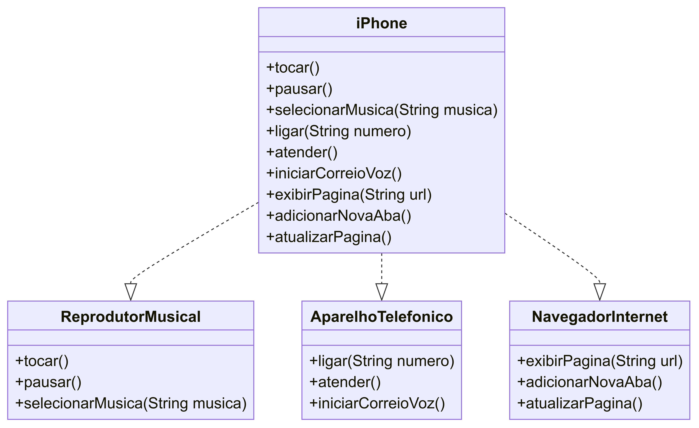

POO - Desafio
Modelagem e Diagramação de um Componente iPhone
Neste desafio, você será responsável por modelar e diagramar a representação UML do componente iPhone, abrangendo suas funcionalidades como Reprodutor Musical, Aparelho Telefônico e Navegador na Internet.

Contexto
Com base no vídeo de lançamento do iPhone de 2007 (link abaixo), você deve elaborar a diagramação das classes e interfaces utilizando uma ferramenta UML de sua preferência. Em seguida, implemente as classes e interfaces no formato de arquivos .java.

Lançamento iPhone 2007

Minutos relevantes: 00:15 até 00:55
Funcionalidades a Modelar
Reprodutor Musical
Métodos: tocar(), pausar(), selecionarMusica(String musica)
Aparelho Telefônico
Métodos: ligar(String numero), atender(), iniciarCorreioVoz()
Navegador na Internet
Métodos: exibirPagina(String url), adicionarNovaAba(), atualizarPagina()
Objetivo
Criar um diagrama UML que represente as funcionalidades descritas acima.
Implementar as classes e interfaces correspondentes em Java (Opcional).

Ver imagem(POO Desafio-UML)

classDiagram
    class ReprodutorMusical {
        +tocar()
        +pausar()
        +selecionarMusica(String musica)
    }

    class AparelhoTelefonico {
        +ligar(String numero)
        +atender()
        +iniciarCorreioVoz()
    }

    class NavegadorInternet {
        +exibirPagina(String url)
        +adicionarNovaAba()
        +atualizarPagina()
    }

    class iPhone {
    }

    iPhone --> ReprodutorMusical
    iPhone --> AparelhoTelefonico
    iPhone --> NavegadorInternet

- Interfaces: ReprodutorMusical, AparelhoTelefonico, e NavegadorInternet contêm os métodos públicos descritos no desafio.
- Classe iPhone: Implementa as três interfaces (ReprodutorMusical, AparelhoTelefonico, NavegadorInternet), o que é representado pelas setas (-->), indicando que a classe iPhone depende dessas interfaces para funcionar.

Esse diagrama mostra as funcionalidades que o iPhone pode desempenhar através das interfaces.

Desenvolvido Por Gilberto F S Junior

******************************************
## Getting Started

Welcome to the VS Code Java world. Here is a guideline to help you get started to write Java code in Visual Studio Code.

## Folder Structure

The workspace contains two folders by default, where:

- `src`: the folder to maintain sources
- `lib`: the folder to maintain dependencies

Meanwhile, the compiled output files will be generated in the `bin` folder by default.

> If you want to customize the folder structure, open `.vscode/settings.json` and update the related settings there.

## Dependency Management

The `JAVA PROJECTS` view allows you to manage your dependencies. More details can be found [here](https://github.com/microsoft/vscode-java-dependency#manage-dependencies).
